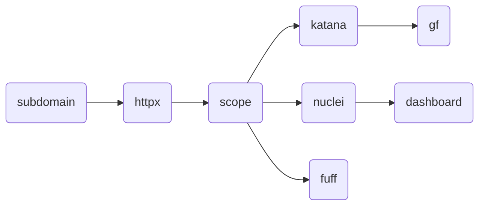

# Reconr


## Architecture

Task -> Une commande
Workflow -> Plein de commandes

Un container par task.


## TODO

- [x] Ajouter la possibilité de faire deux lignes de commandes
- [x] Fixer les logs
- [x] Faire un fichier target avec scope
- [x] Template workflow
- [x] Faire quelque chose pour le scope
- [ ] Droit sur les fichers out
- [ ] Procedure d'install
- [x] Plus de config
- [ ] Faire fonctionner deux containers en parallèle
- [ ] Refactor le code
- [ ] Faire quelque chose avec dnsx, alterx, nabuu
- [ ] Fixer docker build a chauqe fois
- 2024/04/30 08:56:09 Error response from daemon: invalid mount config for type "bind": bind source path does not exist: /home/yann/GolandProjects/reconr/test/config

https://github.com/1ndianl33t/Gf-Patterns
https://github.com/tomnomnom/waybackurls

## jq
```
 cat out2.txt | jq "[.url,.host]"
 cat nulcei.txt | jq '.info | select(.severity == "low")'
```

## Valid scope
```
grep -Ff scope.txt out2.txt | jq -r .url
```

## Nuclei
```
nuclei -u url.com -cloud-upload
```

## Scope
```
root@PCYann:/tmp# grepcidr -f scope.txt target.txt 
192.168.30.4

192.168.10.1/0 -> all ips
```
