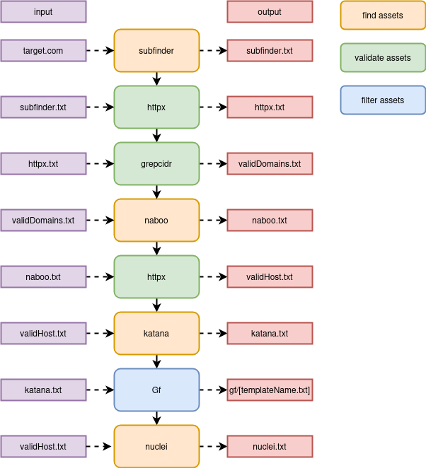
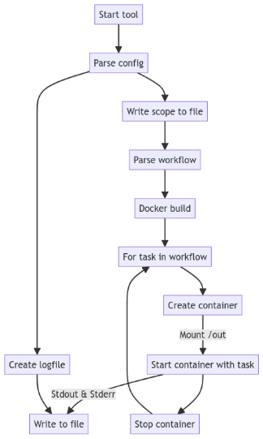

# Reconr

## Introduction

Reconr is an automation tool designed to automate pentesting tasks. 
The core concept revolves around using workflow files, which define a list of tasks that can be applied to multiple targets. 
This approach simplifies repetitive pentesting processes and enhances efficiency.

> This tool as been developed by Yann Grossenbacher while working for Syret Gmbh

## Installation

You will need to install [Docker](https://docs.docker.com/engine/install/) and [Golang](https://go.dev/doc/install). 
I would also suggest to install [jq](https://jqlang.github.io/jq/) for processing the output. 
If your installing it on Ubuntu, juste use this [script](install.sh)

```bash
# Clone the repository
git clone https://github.com/your-username/reconr.git

# Change directory
cd reconr

# Install dependencies
go build -o reconr cmd/reconr/main.go
```
## Usage
1. Edit config.yaml
2. Run the workflow
```bash
./reconr -config ./config.yaml -workflow ./workflow.yaml
```
3. Check the resuts
```bash
cd out/[target.com]
cat subdomain
cat nuclei.txt | jq "[.info.name,.info.severity,.host]"
```

## Configuration
[config.yaml](./config.yaml)
```bash
---
workPath: "./out"
mountWork: "/mount"

logfile: "./log"
scopeFileName : "scope.txt"


target: "scanme.sh"
proxy: "http://127.0.0.1:8080"

configPath: "./config"
mountConfig: "/config"

# If you define no scope, there will be no scope validation
scope:
  #- 192.168.10.0/24
  #- 192.168.20.0-192.168.20.30
```
The workPath will be the path where all the tools are running.
The config path is a folder that can be used to store some wordlist or tools configuration files.

### Workflow
Example of a simple workflow. You can run multiple commands for every task. For every task, a new container will be created.
```yaml
---
tasks:
  1:
    name: "subdomain"
    commands:
      - "subfinder -d {{ .Target }} -duc -cs -pc /config/subfinder-config.yaml -json -o subfinder.txt"
      - "cat subfinder.txt | jq -r .host > subdomain.txt"
      - "echo {{ .Target }} >> subdomain.txt"
  2:
    name: "validateSubdomain"
    commands:
      - "httpx -l subdomain.txt -duc -td -cdn -json -o httpx.txt"
```
All the command will be executed by default in /mount. The folder that being mounted in the container. You can also use /config 
that will be the same for all the targets. So it's a great place to store wordlist or configurations files.  

This is how the default [workflow](./workflow.yaml) works :



### Scope
The ip or ranges your defining in the config file will get copied in scope.txt. Example of using scope validation:
```yaml
  1:
    name: "validateScope"
    commands:
      - "cat domains.txt | grepcidr -f scope.txt > validDomains.txt"
```

### Templating

For now, you can use two fields that will be processed: Target and Proxy. Both are defined in the configuration file.

```
subfinder -d {{ .Target }}
nuclei -l validPorts.txt -p {{ .Proxy }}
```

## Logs
You can find the logs under /log/targetname.log. If you want to see the logs live, you can use tail. `tail -n 10 -f target.com.log`
If you want the get the logs of a currently running task, use the docker logs. `docker logs reconrX -f` X being the task number. 

## Tips
### Read the tools docs
A lot of the tools have very interesting options that are hidden in the documentation. For the project discovery tools :
> https://docs.projectdiscovery.io/tools/index
### Gf
With the default workflow, a gf folder is created, and it's worth a look. You will find some interesting endpoint to dig further.
You can also write your own pattern and add them in the [config](./config) folder. 
> https://github.com/1ndianl33t/Gf-Patterns

### Nuclei
Nuclei is a great tool, but it's even better with your own templates. 
You can add templates in the [config](./config) folder.  
> https://blog.projectdiscovery.io/if-youre-not-writing-custom-nuclei-templates-youre-missing-out/

### Use the power of jq
Jq is the perfect tool to find the interesting stuff in the json output.
You're looking for Windows servers ?
```
cat httpx.txt | grep "Windows Server" | jq "[.tech,.host]"
```
You're looking for the urls that got an 500 error ?
```
cat httpx.txt | grep '"status_code":500' | jq .url
```
> https://jqlang.github.io/jq/manual/

## How it works


## License
